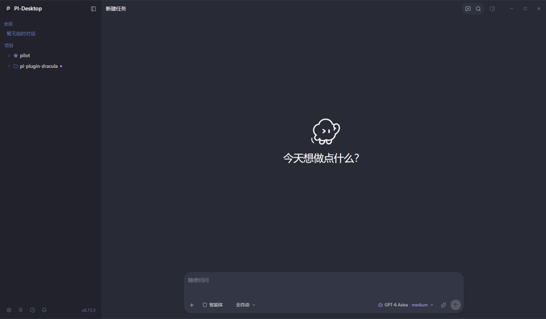
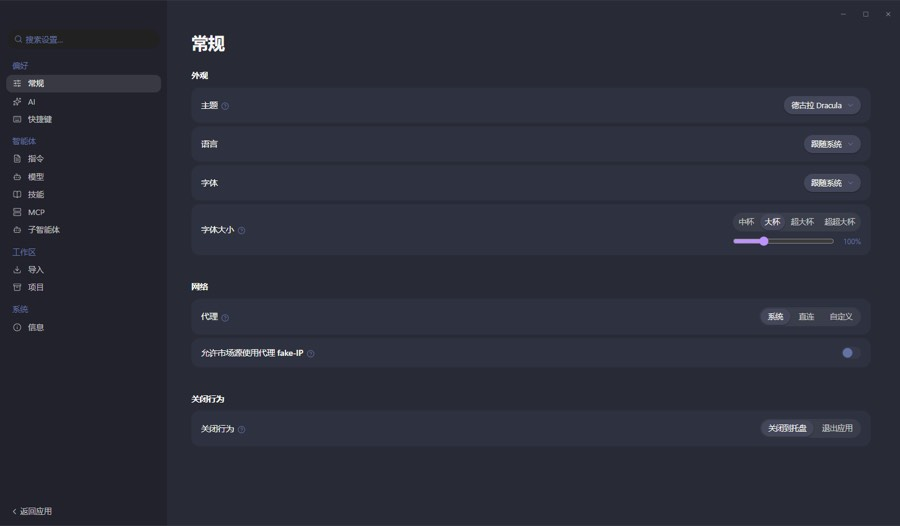

# pi-theme-dracula — PI-Desktop Dracula 主题

A PI-Desktop theme/plugin based on the classic **Dracula** palette
(`#282a36` / `#44475a` / `#f8f8f2` / purple `#bd93f9` / pink `#ff79c6` /
cyan `#8be9fd` / green `#50fa7b` / orange `#ffb86c` / red `#ff5555`).

## Screenshots

| Panel | Settings |
| --- | --- |
|  |  |

## Contributions

- Command `pi-theme-dracula.open` opening a panel from `renderer/index.html`
- A PI-Desktop Theme Studio theme (`dracula`) built from the official Dracula
  palette, mapped onto the host's semantic `--ds-*` tokens per the
  [UI design-system spec](https://pi-docs.aiuo.net/spec/04-ux/07-ui-design-system):
  - Surfaces: `bg-primary #282a36`, `bg-secondary / composer #343746`,
    `bg-tertiary / raised #44475a`, inset & sidebar `#21222c`
  - Text: `#f8f8f2` primary, `#6272a4` muted (Dracula comment blue)
  - Accent: purple `#bd93f9` (hover `#d6acff`, soft `#ff79c6`)
  - Status: success `#50fa7b`, warning `#ffb86c`, error `#ff5555`, info `#8be9fd`

## Develop

1. Open the Plugins page and use **Load development plugin**, pointing at this
   directory. PI-Desktop reloads the plugin whenever you save a file here.
2. Verify the contributions from the command palette.
3. Validate and package:

```bash
pnpm pi-plugin check .
pnpm pi-plugin pack .
# writes dist/local.pi-theme-dracula-0.2.0.piplug
```

Install the resulting `.piplug` from the Plugins page to test it the way a
user would.

### Panel top drag band

PI-Desktop reserves exactly a transparent 46px frameless drag band above panel
content and renders a minimal fixed three-button window-control capsule in its
top-right corner. Normal-flow content is offset automatically. The panel title,
toolbar, and every other visible surface belong to the plugin. Development
panels show a reminder that the top 46px is not clickable outside the capsule.
For `position: fixed` or `position: sticky` content, use
`top: var(--pi-plugin-titlebar-height, 46px)` and account for the same value
in viewport-height calculations. Add `-webkit-app-region: drag` to a
plugin-owned toolbar when it should move the window, and
`-webkit-app-region: no-drag` to controls inside it.
